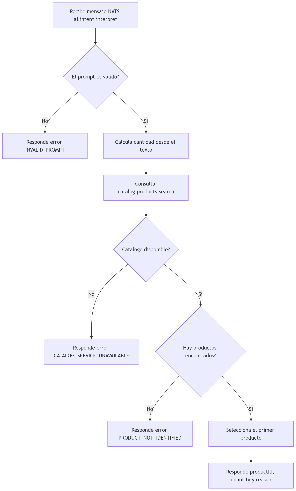

# Qhantuy Agent Quotes

## Requisitos

- Docker y Docker Compose.
- Opcional para desarrollo local: Node.js 22+, Python 3.12+ y npm.

## Inicio rapido con Docker

Desde la raiz del repositorio:

Linux:

```bash
sudo docker compose -f infra/docker-compose.yml up --build
```


Windows:
Asegúrate de que **Docker Desktop** esté iniciado y en ejecución. Luego ejecuta:


```bash
docker compose -f infra/docker-compose.yml up --build
```

Servicios expuestos:

| Servicio | URL |
| --- | --- |
| API Gateway | `http://localhost:3000` |
| Swagger | `http://localhost:3000/docs` |
| NATS monitor | `http://localhost:8222` |
| PostgreSQL | `localhost:5433` |

Para apagar el stack:

```bash
docker compose -f infra/docker-compose.yml down
```

Para apagar y borrar tambien los datos de PostgreSQL:

```bash
docker compose -f infra/docker-compose.yml down -v
```


## Desarrollo local
Copiar y modificar variables de entorno:
```bash
cp .env.example .env
```

Levantar solo la infraestructura:

Inicia únicamente los servicios de infraestructura (`postgres` y `nats`) en segundo plano.

> **Linux:** Si es necesario, utiliza `sudo`.
>
> **Windows:** Asegúrate de que **Docker Desktop** esté en ejecución.

```bash
docker compose -f infra/docker-compose.yml up -d postgres nats
```

API Gateway:

```bash
cd apps/api-gateway
npm install
npm run start:dev
```

Quote Service:

```bash
cd apps/quote-service
npm install
npm run start:dev
```

AI Agent:

```bash
cd apps/ai-agent
python -m venv .venv
.venv\Scripts\activate
pip install -r requirements.txt
python main.py
```

Payment Simulator:

```bash
cd apps/payment-simulator
python -m venv .venv
.venv\Scripts\activate
pip install -r requirements.txt
python main.py
```


## Arquitectura

```text
Postman 
        |
        v
API Gateway (NestJS)
        |
        | HTTP -> NATS Request/Reply
        v
NATS
  |--------------------------|-------------------------------|
  v                          v                               v
Quote Service (NestJS) <-> AI Agent (Python)    Payment Simulator (Python)
  |
  v
PostgreSQL
```

## Servicios

| Servicio | Ruta | Responsabilidad |
| --- | --- | --- |
| API Gateway | `apps/api-gateway` | Expone la API REST para Postman o frontend. No contiene logica de negocio. |
| Quote Service | `apps/quote-service` | Maneja reglas de negocio, cotizaciones, persistencia y catalogo de productos. |
| AI Agent | `apps/ai-agent` | Interpreta intenciones de compra, calcula cantidad y consulta el catalogo por NATS. |
| Payment Simulator | `apps/payment-simulator` | Simula la ejecucion de compra/pago por NATS, sin base de datos ni dinero real. |
| Infra | `infra/docker-compose.yml` | Levanta PostgreSQL, NATS y los servicios de la solucion. |


## Flujo funcional

1. `api-gateway` recibe la solicitud HTTP.
2. `quote-service` valida el usuario activo.
3. `quote-service` llama a `ai.intent.interpret`.
4. `ai-agent` consulta `catalog.products.search` en `quote-service`.
5. `quote-service` busca productos activos por `name`, `description`,
   `category`, `keywords` y `tags`.
6. `quote-service` calcula total.
7. Una persona aprueba o rechaza la cotizacion.
8. Si se aprueba, `quote-service` ejecuta la compra simulada con
   `payment-simulator`.


## Flujo del agente


## Ejemplos de uso 
### Crear cotizacion

```http
POST http://localhost:3000/api/agent/quote
Content-Type: application/json

{
  "prompt": "quiero comprar mochilas urbanas",
  "requestedByUserId": "b6fd7d2d-5e56-4b37-a761-2d69b86a9e91",
  "quantity": 2
}
```


### Aprobar cotizacion

```http
POST http://localhost:3000/api/agent/quote/{quote_id}/approve
Content-Type: application/json

{
  "approvedByUserId": "9cc1fe5e-8b25-4e3d-908e-d9aa0d8f51f2"
}
```

### Ejecutar compra simulada

```http
POST http://localhost:3000/api/agent/quote/{quote_id}/execute
Content-Type: application/json

{
  "executedBy": "9cc1fe5e-8b25-4e3d-908e-d9aa0d8f51f2"
}
```

### Rechazar cotizacion

```http
POST http://localhost:3000/api/agent/quote/{quote_id}/reject
Content-Type: application/json

{
  "rejectedByUserId": "47ad93a6-44fa-494c-88cc-7a865639e2d0",
  "reason": "Cliente no confirmo la compra"
}
```

## Datos iniciales

El contenedor `quote-service` usa TypeORM para crear el esquema y sembrar el
catalogo inicial al iniciar. Los productos incluyen `category`, `keywords`,
`tags` y `metadata` para busqueda por intencion.

### Productos

| ID | SKU | Nombre | Categoria | Keywords |
| --- | --- | --- | --- | --- |
| `0e2b0f7f-6f5f-4b35-a0d8-1e42dd90791f` | `MOCHILA-URBANA` | Mochila urbana | `backpack` | `mochila`, `mochilas`, `morral`, `bolso escolar`, `backpack` |
| `24e44649-8b2d-42b5-bcfd-46d4f4e4f7a8` | `MOCHILA-VIAJE` | Mochila de viaje | `backpack` | `mochila de viaje`, `mochila viajera`, `viaje`, `equipaje` |
| `8f8e2095-7c5b-4b5b-9ea0-c37f8fd5cc64` | `CARTERA-CUERO` | Cartera de cuero | `handbag` | `cartera`, `carteras`, `bolso`, `bolsa`, `handbag` |
| `d6a3868d-f4ac-4bf8-b295-573037f08811` | `BILLETERA-COMPACTA` | Billetera compacta | `wallet` | `billetera`, `billeteras`, `monedero`, `wallet` |
| `62be4a2a-0df9-4422-92f6-0a6d3d8e17d4` | `LONCHERA-TERMICA` | Lonchera termica | `lunchbag` | `lonchera`, `loncheras`, `termica`, `lunch bag` |
| `75b5e2ad-3d99-4f3f-a817-c1a6e5a1f1bb` | `CARTUCHERA-ESCOLAR` | Cartuchera escolar | `pencil_case` | `cartuchera`, `cartucheras`, `estuche`, `lapicera` |
| `a7f88841-c6c6-4e68-8848-0da368b64d7a` | `MORRAL-CROSSBODY` | Morral crossbody | `crossbody` | `morral`, `bolso cruzado`, `crossbody`, `canguro` |
| `ca56771b-04a7-47d4-9f47-f1577d97682e` | `MALETA-CABINA` | Maleta de cabina | `luggage` | `maleta`, `maletas`, `equipaje`, `carry on`, `cabina` |

### Usuarios de dominio

| Nombre | Email | UUID |
| --- | --- | --- |
| Juan Perez | `juan.perez@example.com` | `b6fd7d2d-5e56-4b37-a761-2d69b86a9e91` |
| Maria Lopez | `maria.lopez@example.com` | `9cc1fe5e-8b25-4e3d-908e-d9aa0d8f51f2` |
| Carlos Rojas | `carlos.rojas@example.com` | `47ad93a6-44fa-494c-88cc-7a865639e2d0` |
| Ana Fernandez | `ana.fernandez@example.com` | `f2c41e10-a105-4c09-9bc8-e7980799d21e` |
| Pedro Gomez | `pedro.gomez@example.com` | `6c77170e-87ad-4f49-9848-c618b06030f7` |

No hay autenticacion ni login. Estos usuarios solo extienden el modelo de
dominio.

## Variables de entorno

La raiz incluye `.env.example` para desarrollo local. Docker Compose ya
configura las variables internas necesarias entre contenedores.

Variables principales:

- `DATABASE_URL`
- `NATS_SERVERS`
- `NATS_REQUEST_TIMEOUT_MS`
- `CATALOG_REQUEST_TIMEOUT_SECONDS`
- `PORT`
- `API_GLOBAL_PREFIX`
- `QUOTE_EXPIRATION_MINUTES`
